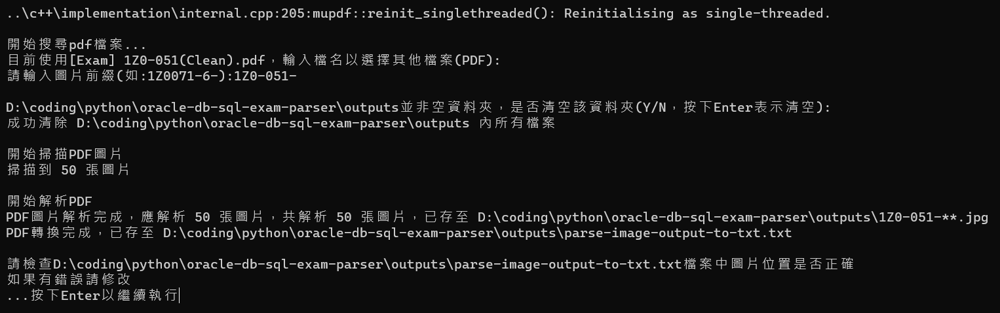

# oracle-db-sql-exam-parser

### 1. 請先安裝 python 3.0

### 2. cmd 運行

```console
pip install openpyxl
pip install aspose-cells-python
pip install --upgrade pymupdf
```

### 3. <span style="color:red">請確保該pdf檔以及main.py在同一個文件夾底下</span>

### 4. 運行main.py，以下為運行結果



### 5. 可於cmd中查看分析結果，如：


### 6. 輸入e導出為excel
### 7. 輸入q或Ctrl+c離開
### 8. 進入outputs，全選並打包成zip，上tronClass匯入