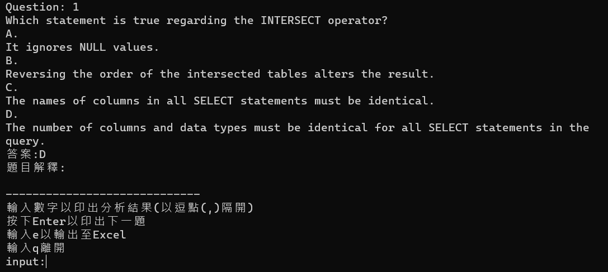
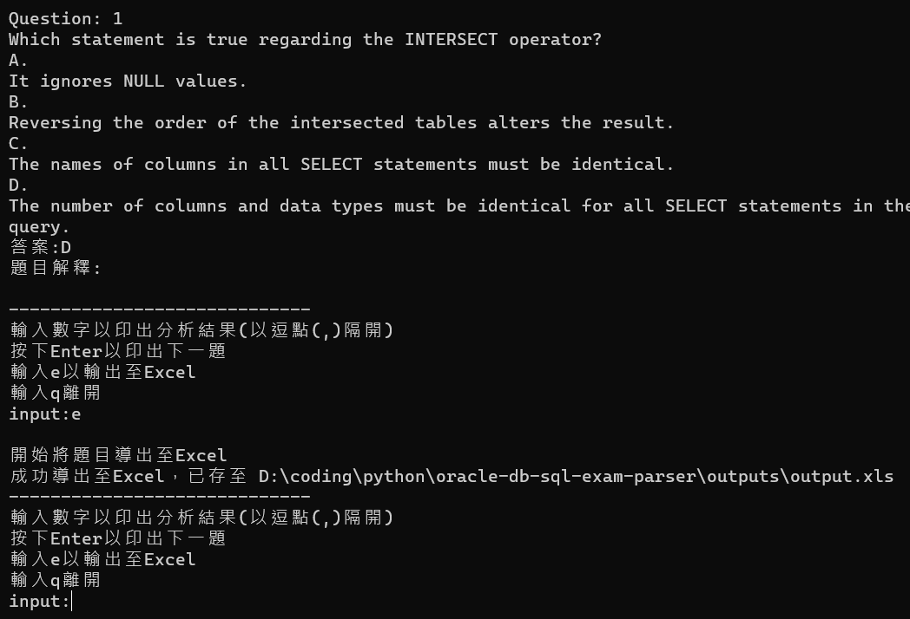

# oracle-db-sql-exam-parser

### 1. 將PDF檔放至資料夾根目錄

### 2. 運行main.exe，依照指示操作，操作完畢後請檢查圖片

### 3. 檢查圖片完畢後，按下Enter繼續操作

### 3. 可於cmd中查看分析結果，如：

### 4. 輸入e導出為excel

### 5. 輸入q或Ctrl+c離開
### 6. 進入outputs，全選並打包成zip，上tronClass匯入